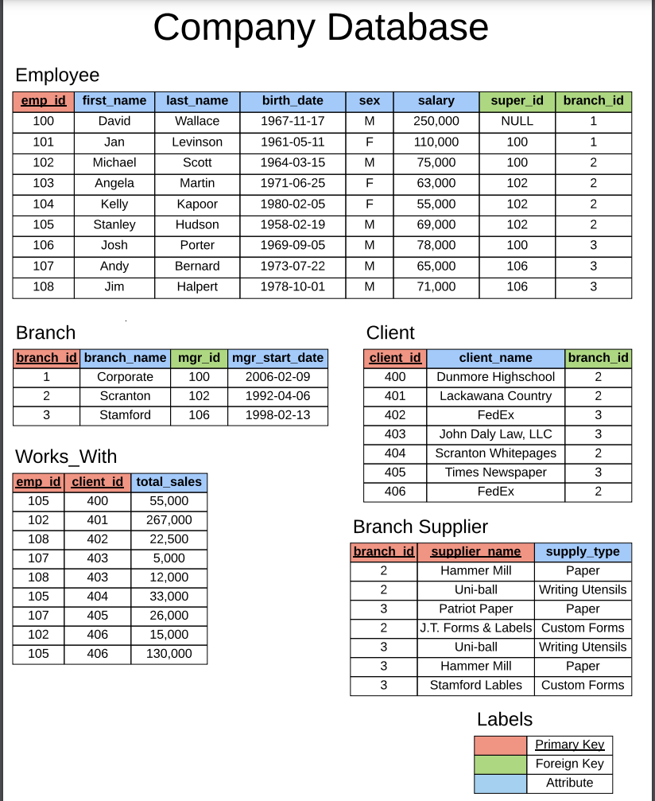
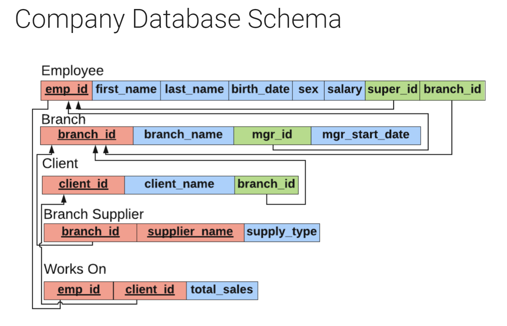

# SQL_Tutorial
An SQL tutorial for an introduction to SQL in MySQL

## Table of Contents
- [Introduction](#introduction)

## Introduction
Provide a brief introduction to SQL and its importance in database management.

## Company Database
Provide an overview of the company database used throughout the tutorial. Include a description of the tables, their relationships, and any relevant sample data.

The company database consists of the following tables:

- Employees: Contains information about the employees in the company, such as their ID, name, and salary 
- Branch : Stores details about the different departments in the company, including the department ID and name.
- Branch supplier : indiacte the supplier name and the type of suppliance 
- Client: Holds information about the clients in the company 
- Works_with : Represents the relationship between employees and clients, indicating with which client the employee work.

Here is a sample entry relation diagram for the company database:

For more detailed information about the company database and its structure, please refer to the [database documentation](https://www.giraffeacademy.com/databases/sql/company-database-documentation).

For the full tutorial, please visit [this link](https://www.giraffeacademy.com/databases/sql/).

